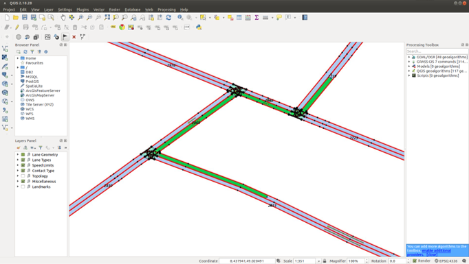

## Design of Intersection API 

Another relevant aspect when making use of map data for automated driving is priority
handling within intersections. Therefore, ad_map_access provides special functionality
to cope with intersections. Since the priority handling within an intersection is tightly
coupled with the route a vehicle drives through the intersection, a route (or parts of it)
 are used as basis for the creation of an intersection::Intersection() class.

A call of the static function intersection::Intersection::getIntersectionsForRoute(route::FullRoute)
in the below sketched example, returns a list with three intersection::Intersection objects.

|  |
| -- |
| *Visualization of a route with three intersections on the way* |

### Priority rules within intersection
The intersection object internally calculates the priority rules for lanes of the intersection:

- What are the lanes of the intersection
    - internal intersection lanes (with higher prio, with lower prio)
    - lanes outside the intersection entering (incoming) or leaving (outgoing) intersection
    - lanes of the ego-route through the intersection
- What are the (relevant) traffic lights on the ego-route through the intersection?
- What is the turn direction of the ego-route through the intersection?

### Object checks for the intersection
The intersection::Intersection object provides checks for objects and their relation in respect
to the intersection like is an object...

- within the intersection
- on a crossing lane
- on a lane with higher/lower prio
- on an internal or incoming lane (with higher prio, with lower prio)
- on a route crossing the ego route through the intersection on lanes with higher prio
- on a route from the same intersection arm
- on a route from the exactly opposite direction through the intersection

These checks build the basis for maneuver planning at intersection level.

### Supported intersection types
For sure, the current implementation does not support any intersection configuration thinkable,
but it builds a basis and should work for common types of intersection in right-handed traffic
as well as in left-handed traffic:

- HasWay
- Stop
- Yield
- AllWayStop regulation (U.S.A.)
- Traffic Light regulated intersections
- Crosswalk (which is treated as a special kind of intersection)
- PriorityToRight
- PriorityToRightAndStraight (Singapore)
