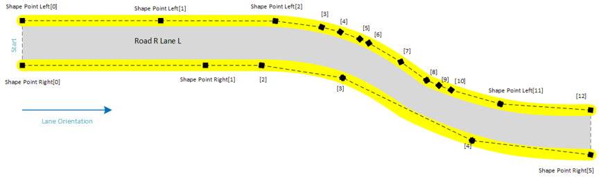
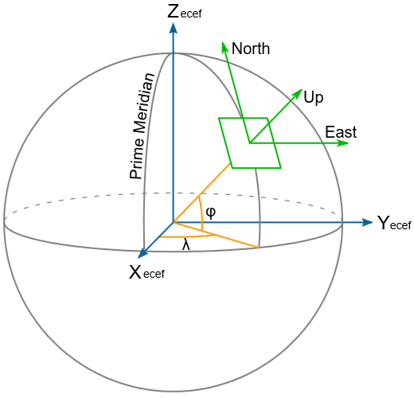
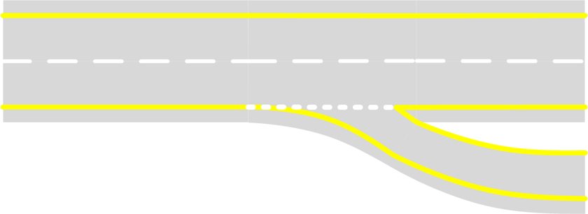
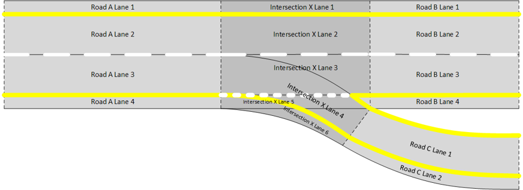
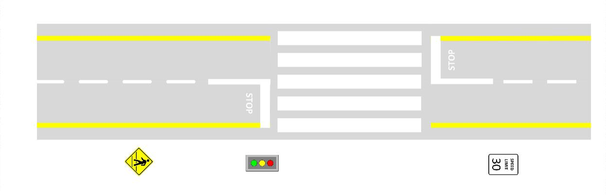
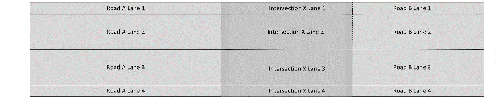
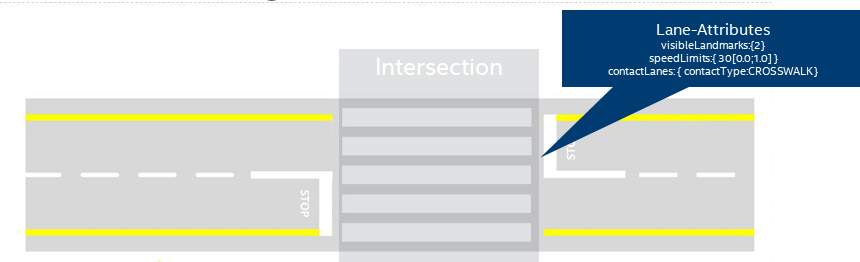
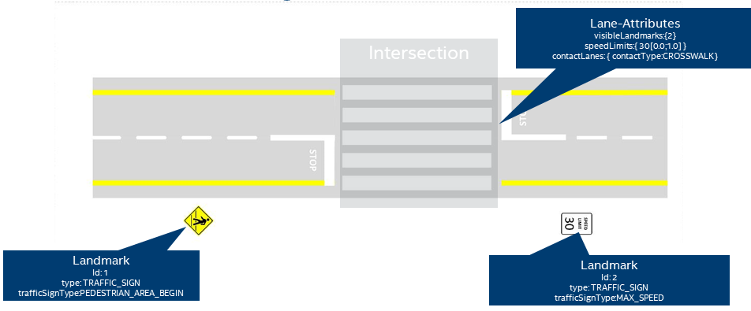

## Map Data Model 

The data model of the map consists of multiple different aspects. The major ones are described
in the following in more detail.

### Lane 
The main features of a road network are the lanes as part of the drivable surface where traffic
is moving primary longitudinally. In general, a lane does not share surface with any other object
with one important exception: intersection lanes. The main attributes of a lane are constant;
whenever respective attributes change in real-world, a lane ends and new lane begins.

#### Lane Types 
There are different types of lanes. The most prominent types are the following:

- _NORMAL_: Standard road lane that can accommodate single row of vehicles.
- _INTERSECTION_: Physical or Logical Lane connecting two non-intersection lanes over Intersection area.
- _SHOULDER_: Non-drivable lanes next to _NORMAL_ lanes on the road.

#### Lane Topology and Contacts 
The topology of lanes are described via contact relationships. Every lane holds a list of contact
relations to other lanes where a contact can have:

- Physical characteristics: location ∈ {LEFT, RIGHT, SUCCESSOR, PREDECESSOR, OVERLAP}
- Logical characteristics: type ∈ {CROSSWALK, LANE_CHANGE, LANE_END, STOP, TRAFFIC_LIGHT, …},
trafficLightId, restrictions (e.g. RoadUserType != TRUCK)

#### Lane Geometry 
The shape of lanes are described in 3D space as a vector of 3D points in earth-centered, earth-fixed
coordinates [ECEF](#ecef). A lane has an list of left and right border points: the left and the right edge.
The physical orientation of the lane is given by the order of the points.
The following picture sketches a lane:

|  |
| -- |
| *Sketch of the ordered lane edge points as the geometry description of the lane* |

Because at runtime the shape points of the lane borders are often queried in a local East, North, Up
coordinate system the lane geometry object provides an internal ENU cache.

### Coordinate Systems 

#### ECEF 

|  |
| -- |
| *Sketch of the ECEF coordinate system and its axis in respect to the earth* |

ECEF ("earth-centered, earth-fixed") is a geographic coordinate system and Cartesian coordinate system.
It represents positions as an X, Y, and Z coordinate. The point (0,0,0) is defined as the center of mass
of the earth, hence the name "earth-centered." Its axes are aligned with the international reference
pole (IRP) and international reference meridian (IRM) that are fixed with respect to the surface of the
earth, hence the description "earth-fixed.“ The z-axis extends through True north, which does not coincide
with the instantaneous earth rotational axis. The x-axis intersects the sphere of the earth at 0° latitude
(the equator) and 0° longitude (prime meridian in Greenwich). This means that ECEF rotates with the earth,
and therefore coordinates of a point fixed on the surface of the earth do not change.

Source [Wikipedia](https://en.wikipedia.org/wiki/ECEF)

#### ENU 

|  |
| -- |
| *Sketch of an ENU coordinate system and its location on the earth* |

In many targeting and tracking applications the local East, North, Up (ENU) Cartesian coordinate system
is far more intuitive and practical than ECEF or Geodetic coordinates. The local ENU coordinates are
formed from a plane tangent to the Earth's surface fixed to a specific location and hence it is
sometimes known as a "Local Tangent" or "local geodetic" plane. By convention the east axis is
labeled x, the north y and the up  z.

Source: [Wikipedia](https://en.wikipedia.org/wiki/Geographic_coordinate_system)

### Road Network 

The representation of the road network with the lane model is sketched in the following with some examples.

#### Freeway Exit
Let's look at a freeway with 2 lanes, shoulders and an exit lane connected.

|  |
| -- |
| *An example of a freeway exit* |

As described in the [lane section](#lane) lanes end when their main attributes are changing which happens:

- in longitudinal direction before and after the freeway exit
- in lateral direction between the single lanes

The sections of the road before the freeway exit (depicted as *Road A*) and after the freeway exit
(depicted as *Road B*) consists of four lanes each:

- the two outer shoulder lanes (1, 4) of lane type _SHOULDER_
- the two inner lanes (2, 3) of lane type _NORMAL_

The section of the road after the freeway exit (depicted as *Road C*) consists of two lanes:

- one _NORMAL_ lane (1)
- one _SHOULDER_ lane (2)

The normal drivable lanes (2, 3, 4)  that are part of the intersection (depicted as *Intersection X*)
are of type _INTERSECTION_ instead of type _NORMAL_ to indicate their functionality. The shoulder lanes
still are of type _SHOULDER_ to distinguish them from drivable and routable lanes.

|  |
| -- |
| *The lane model of the above freeway exit* |

But the lane type is not the only relevant attribute. Especially the lane contacts provide relevant
semantic information. E.g. the IntersectionXLane3 physical contacts are the following:

- toLane: RoadALane3, location: _PREDECESSOR_
- toLane: RoadBLane3, location: _SUCCESSOR_
- toLane: IntersectionXLane2, location: _LEFT_
- toLane: IntersectionXLane4, location: _OVERLAP_
- toLane: IntersectionXLane5, location: _RIGHT_

It is to mention, that in the actual map the lanes are identified by an unique laneId instead of a
descriptive name as used for explanation herein.

#### Pedestrian Crossing
After getting a basic idea on the physical topology of the lanes within the road network, a pedestrian
crossing provides an example on the right of way handling.

|  |
| -- |
| *A pedestrian crossing to demonstrate right-of-way handling* |

On the one hand side, a pedestrian crossing is an intersection. Therefore, the physical topology follows
the intersection use-case from the section before:

|  |
| -- |
| *The lane model of the above pedestrian crossing* |

When looking into detailed attributes of the lanes in contact with the intersection lanes,
the type of contact of these lanes is the special _CROSSWALK_ type. The contact from RoadALane3
look e.g. the following:

- toLane: IntersectionXLane3, location: _SUCCESSOR_, type: _CROSSWALK_

|  |
| -- |
| *A pedestrian crossing with respective lane attributes* |

Having these special contact types in conjunction with the lane type _INTERSECTION_ one is able to
search intersections within the road network and provide additional access functions and operations
on an [intersection](#intersectionapi).

### Landmarks
As already illustrated in the pictures of the crosswalk above, there are also traffic signs and/or
traffic lights in the map data having specific semantics. In the end these are summarized by the
general term *Landmark* supporting different types of landmarks
{ TRAFFIC_SIGN, TRAFFIC_LIGHT, POLE, GUIDE_POST, TREE, STREET_LAMP, etc.}.
Similar to lanes, every landmark has its landmarkId as unique identifier.
Landmarks have a dedicated position and orientation in the world as well as a bounding box.
Traffic lights and Traffic signs have additional information  defining the concrete details on
it (like subtype or supplementary text).

Coming back to the pedestrian crossing example from above, an example traffic sign and traffic light are provided:

|  |
| -- |
| *A pedestrian crossing with standard crosswalk regulation and its landmarks* |

When taking traffic lights into account, the lane the concrete traffic light is relevant for, has to be
explicitly modelled within the lane contact attribute.

|  |
| -- |
| *A pedestrian crossing with traffic light regulation and its landmarks* |

### Speed Limits and other Restrictions
Speed Limits and other restrictions are attached directly at lane level.

#### Speed Limit
Every lane can contain a list of speed limits whereas every speed limit itself has a value provide as
well as a parametric range [0.0 &le; rangeStart &le; 1.0; rangeStart &le; rangeEnd &le; 1.0] of the
lane where it is active.

#### Other Restrictions
The map data model supports further rudimentary restrictions like type of road user or e.g. HOV
(high occupancy vehicles) lanes. When considering a specific vehicle configuration one is able
to check whether a lane is allowed for the vehicle or not.
