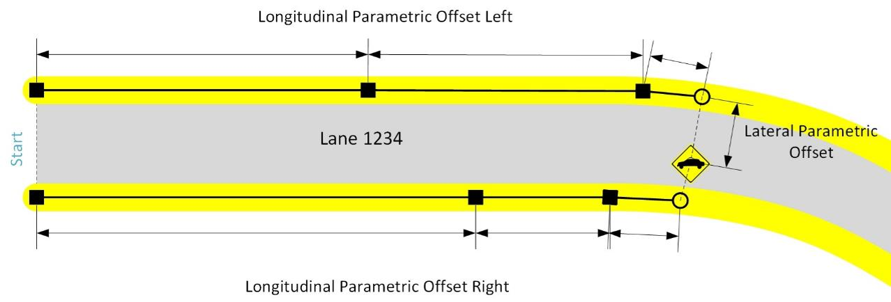
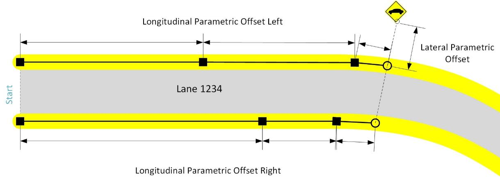
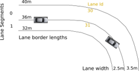
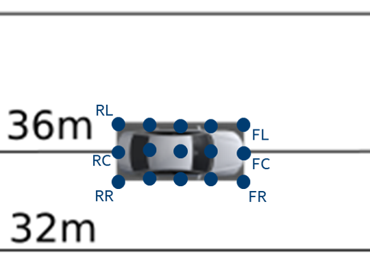
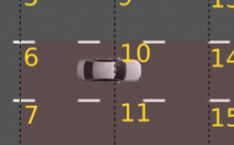
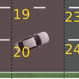

## Design of map matching API <a name="mapmatchingapi"></a>

One of the basic features to be used on top of map data is map matching: Input is a position in
the local ENU coordinate frame and output the list of lanes which are in the near surrounding of
that position.

### Parametric position on a lane
One possibility to describe a certain position within a lane of the map API is the parametric position.
Every position within a lane can be described by a pair of longitudinal and lateral offset.

|  |
| -- |
| *Sketch of a parametric position within a lane with longitudinal and lateral parametric offsets* |

#### Longitudinal parametric offset in a lane
Let the border of a lane be described by a list of points. The length of that border is then
defined as the sum of the distances between the sampling points. The parametric offset on such
a border is defined to be 0.0 at the first point and 1.0 at the last point of that border.
Any position in between the first and last point on that border is defined exactly by the
sum of the distances between the sampling points before plus the distance of the last sampling
point before to the position itself, divided by the length of the border.

Considering a certain position within the lane, the perpendicular projection of the position
to both the borders define the parametric point at the left border (_PLB_) and the parametric
point at the right border (_PRB_) which lead to the longitudinal parametric offset left
(offest_lon_left = 0.47) and right (offest_lon_right = 0.51) respectively.

#### Lateral parametric offset in a lane
The lateral offset within a lane is calculated by connecting these left (_PLB_) and the
right (_PRB_) border points and projecting the original position onto this connecting segment.
Then the lateral offset of the point at the left border, _PLB_, is defined to be 0.0.
The lateral offset of the point at the right border, _PRB_, is defined to be 1.0.
The lateral offset of the position is defined by the distance of the position to _PLB_
divided by the length of segment between _PLB_ and _PRB_. In the sketched example
the lateral parametric offset is about offset_lat = 0.7.

#### Parametric lane position
Finally, the parametric position is then calculated by:

```
offset_lon = offset_lat * offest_lon_right +  (1- offset_lat) * offest_lon_left
           = 0.7        * 0.51             +       0.3        * 0.47
           = 0.498
```

Leading to the parametric position:

```
laneId: 1234
offset_lon: 0.498
offset_lat: 0.7
```

### Map Matched Position
The parametric lane position as described in the previous section is the main part of
the map matching result. Since while map matching especially the lane width at the map
matched position is calculated, the result is extended by the lane's length information.
As the projection calculations performed while map matching finally lead to a slightly
different ECEF point than the actually queried point, a map matched position contains
these two points explicitly. Furthermore, a map matched position has a certain type,
depending if the matched point is located within the lane or besides the lane.

#### In-Lane
|  |
| -- |
| *Map matched position located in-lane* |

The above image sketches a map matched position actually within the lane 1234.

#### Out-of-Lane
|  |
| -- |
| *Map matched position located out-of-lane* |

The above image sketches a map matched position actually outside the lane 1234.

#### Map matching and probabilities
In addition, a single map matched position comes with a certain probability.
If a single map matched position is calculated, using lane::findNearestPointOnLane(),
the probability of an out-of-lane matched position is between [0.1; 0.5], an in-lane
match is rated between [0.5; 1.0]. The exact values depend on the lateral offset from the center line.

Usually, one uses the match::AdMapMatching class to provide a list of map matches.
There, the probability of the result list is normalized to sum up to 1.0. In addition,
the class match::AdMapMatching allows the user to provide a heading hint as well as
a route hint to be considered in the probability calculation. The heading hint factor
(default 2.) increases the probability of lanes having a similar heading than the
heading hints provided. The route hint factor (default 10.) increases the probability
of the lanes that are part of the route hint given. These two features are useful to
maintain the order of the map matching results of a certain vehicle constant on its
way along a certain route.

### Map Matching of vehicles
The above core map matching functionality considers single points to be matched to the
road network. But often, there is the need of matching whole vehicles to the road.
Since a vehicle has a bounding box the map matching of a vehicle is also providing
a match::MapMatchedBoundingBox result.

Considering the following situation where a vehicle is driving in between two lanes
(lane 30, lane 31). First of all the map matching of a vehicle contains the list of
map matching positions for the five reference positions within the vehicle:

 - Front Left
 - Front Right
 - Center Point
 - Rear left
 - Rear right

|  |
| -- |
| *Sketch of a car driving within lanes of different geometries* |

#### Lane Occupied Regions
But this information often is not sufficient, because bigger vehicles might span short
lane segments completely or by other means not all relevant sections of a lane are
considered by these map matching reference positions. To cope with this, the concept
of lane occupied regions is introduced. These are calculated by sampling the whole
bounding box of the vehicle by map matching:

|  |
| -- |
| *Detailed view of the vehicle and its example sampling points* |

Then from the all single matching results the union of the occupied parametric range,
consisting of minimum and maximum longitudinal/lateral parametric extent, for every
single lane is calculated. The above example gives for the respective points within
lane 30 e.g.:

```
RL: lon = 0.098 lat=0.8
FL: lon = 0.196 lat=0.8
RC: lon = 0.1 lat = 1.0
FC: lon = 0.2 lat = 1.0
```

and within lane 31:

```
RC: lon = 0.1 lat = 0.0
FC: lon = 0.2 lat = 0.0
RR: lon = 0.10375 lat=0.3
FR: lon = 0.2075 lat=0.3
```

Resulting in the occupied regions:

```
laneId:30
lonRange:{0.098; 0.2}
latRange:  {0.8; 1.0}
```

and:

```
laneId:31
lonRange:{0.1; 0.2075}
latRange:{0.0; 0.3}
```

Another example in the below sketched situation with the vehicle crossing the longitudinal
lane border between lanes 6 and 10

|  |
| -- |
| *Example of occupied regions with vehicle crossing the longitudinal lane border* |

result in the following occupied regions:

```
laneId:6
lonRange:{0.6; 1.0}
latRange:{0.2; 0.8}
```

and:

```
laneId:10
lonRange:{0.0; 0.2}
latRange:{0.2; 0.8}
```

And finally an example with the vehicle driving with a different heading than the lanes
at this position between lane 19 and 20

|  |
| -- |
| *Example of occupied regions with vehicle crossing the lateral lane border diagonally* |

result in the following occupied regions:

```
laneId:19
lonRange:{0.15; 0.8}
latRange:{ 0.8; 1.0}
```

and:

```
laneId:20
lonRange:{0.05; 0.8}
latRange:{ 0.0; 0.3}
```
