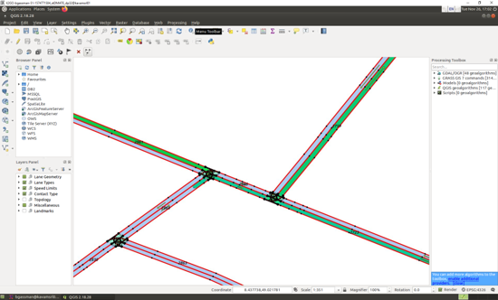

## Design of routing API 
Another core feature to be used on top of map data is routing. For this the ad_map_access
library provides an implementation of an A* algorithm on top of the topological road network data.
Having this in place one is able to plan a route between two points in the map:

|  |
| -- |
| *A planned route (green) through the road network* |

### Route planning
Thereby, the route planning functions provide different overloads (route::planRoute() )
and/or routing options to be able to e.g.:

- Consider or ignore the lane orientation at routing start position
- Consider or ignore the lane orientation at routing destination position
- Consider or ignore the nominal driving direction of the lanes

The route planning algorithm is returning an object of type route::FullRoute.
A full route always contains all drivable lanes parallel having the same nominal driving direction
within a certain road segment. Therefore, the planning result in a multi-lane road
layout looks as sketched in the following QGIS screenshot:

|  |
| -- |
| *A planned route (green) through the road network with multiple lanes for one driving direction* |

### Route prediction
Besides route planning also prediction functionality is implemented.
The functions of the route::predictRoute* family provide a list of possible routes
(FullRoute) within a certain:

- Distance
- Duration

|  |
| -- |
| *Route prediction results in three predicted routes (different green tones)* |

### Connected route
By applying the standard route planning functionality while ignoring the nominal
driving direction leads to a special kind of route calculation.
Considering two vehicles on the road one is able to query the route connecting these
two vehicles with each other by calling the route::calculateConnectingRoute() function.

### Operations on Routes
Besides the pure planning functionality of routes, there are especially a broad
spectrum on operations defined based on routes. This includes e.g. the following areas:

- Iterate on route, Query sections of the route, Query speed limits on route
- Calculate length and (expected) duration
- Get borders (left and right edge) of the route (or parts of it) which can be used
to calculate the driving corridor for a vehicle within ENU coordinate frame.
- Shorten route and route segments
- Extend route by time or distance
- Add opposing lanes to route (used to extend a route to bypass static obstacles on the lane)
- Find (required) lane change
- Find (neareast) waypoint on route based on diverse query input
   - lane::LaneId
   - point::ParaPoint (laneId, parametricOffset)
   - point::ParaPointList (list of point::ParaPoint)
   - MapMatchedPositionConfidenceList
   - Object on route: MapMatchedBoudingBox
   - Intersection on route
