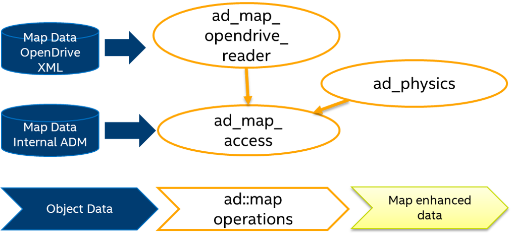

## Design for security 
This chapter discusses security aspects.

### Architecture and dataflow
The library is single-thread, does not make network connections, and does not make connections
with other processes remote or local. It makes use of a singleton concept to store the map data
only once in the process memory. Furthermore, it is multi-thread safe on the all read-access
kind operations.

The library makes only use of basic 3rd party components, and as such does not have security dependencies.
The primary adversary model is one where invalid/incorrect input data could be provided to the library
input interface by the system or from an upstream source.

When integrating ad_map_access into a larger system the following dataflow can be observed:

|  |
| -- |
| *Basic overview of the libraries, the data input and output* |

In the following sections, we discuss security aspects related to:

- map input data
- object data input
- as well as some runtime aspects

that have to be considered when integrating the library into a system.

### Map Data Input
The core data processed by ad_map_access is the actual map data, which is either loaded
via the ad_map_opendrive_reader library, or the reader of the proprietary binary ADM format.
 Adversaries can inject malware into the map data. Therefore, map data
 (map file on disk or map data received via network) should be authenticated before loading into memory.
 The internal implementation for reading and loading map data performs only basic checks
 on the validity of the map data structures and reports errors to the user when loading of the map data fails.

### Object Data Input
Most operations on the map data make use of derived (virtual) sensor data like,
e.g. the position and the extend of vehicles. Also here, adversaries can inject
malware into this kind of information derived from sensor data. Therefore, input data
like object and ego position, dimensions, etc. should be authenticated if data is received
via e.g. network channels. Furthermore Concurrent Error Detection (CED) methods should
be applied to this kind of input data to increase the resilience against malicious attacks
on system level. One aspect of this are redundancies by deploying the input from different
sensors to measure the object states. Another aspect is temporal redundancy which is
immanent to object data, because objects in the world obey the laws of physics and
therefore their states cannot change spontaneously.

### Input and processing data
The library attempts to ensure the validity of the input and processing data, and handle
cases of improper or invalid input data, in several ways. Several explicit checks
of the input data validity are performed. Check that the data structures and basic
data types are internally consistent (e.g. requested lanes exist). If the constraints
are violated, the routine returns with the success/fail flag set to 'fail' or throw an
exception where data type ranges are violated. For this, the routines withinValidInputRange()
and isValid() are used. The respective Doxygen description of these contains the absolute
values against which the inputs (like e.g. coordinates, etc.) are checked.

### Runtime and Processing
The calculations done by ad_map_access are usually finished within a certain time,
but algorithms like map matching or route planning of many vehicles might require
some time, which especially increases with the number of vehicles in the surrounding.
If operations on system level have strict latency requirements, the processing times
of ad_map_access functions should be observed externally to be able to report potential violation.

### Error and Exception Handling
Functions of ad_map_access report errors by means of return values or may throw an exceptions.
A failure of a logic check or of a subroutine results in interruption of the routine and
a fail flag being passed to the calling routine. Reported errors have to be handled and
reported properly on system level integration.

### Logging
For logging purposes spdlog and the ostream operators of data types and structs are used.
The output of the logger is per default the command-line.

### Coding standards

Code quality has been ensured through peer code reviews and unit testing.
Unit testing code coverage of can be retrieved via github deployment:
<todo: insert coverage link here>

### Compiler and compiler security flags

The development platforms are Ubuntu Linux 18.04 Bionic and 20.04 Focal Fossa.

A standard cmake toolchain has been used to compile the library.
The compiler is g++ 9.3.0, other compilers are also supported (see README for details).

The following, strict, compilation flags are used: C++14, -Werror, -Wall, -Wextra,
-pedantic, -Wconversion, -Wsign-conversion, -Wfloat-equal -Wshadow -Wswitch-default
-Wenum-compare -Wformat -Wformat-security.

* -Werror turns all warnings into errors
* -Wall enables many warnings about code constructs that are questionable
* -Wextra enables additional warnings not enabled by -Wall
* -Wconversion warns for implicit conversions (e.g. between integer and real types)
* -Wsign-conversion warn for implicit conversions that may alter a value
* -pedantic issues all warnings demanded by strict ISO C and C++
* -Wfloat-equal warn if floating-point values are used in equality comparisons
* -Wshadow warn on shadowed variable declarations
* -Wswitch-default warn if the default case is missing in a switch
* -Wenum-compare warn about a comparison between values of different enumerated types
* -Wformat* warns about errors within format strings

In addition, there are compiler flags

* -fstack-protector-all -fasynchronous-unwind-tables -fno-omit-frame-pointer
-fno-delete-null-pointer-checks -fno-strict-overflow -fwrapv -fPIE -fPIC -D_FORTIFY_SOURCE=2

and linker flags

* -Wl,-z,now -Wl,-z,relro -pie

defined to harden the resulting binaries. Hardening is disabled by default,
as build hardening is usually injected by the surrounding build system.

Compilation with these flags completes without any error or warning.

### Critical assets

The library does not contain critical assets from a security perspective, other than the library code itself.
