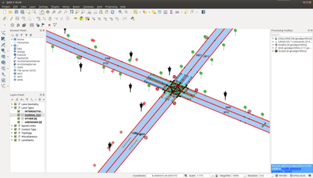
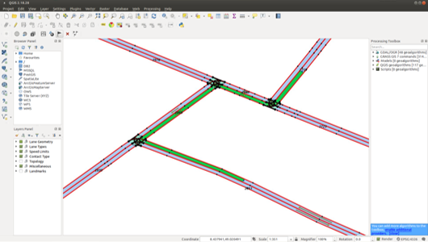

# C++ Library for Accessing Automated Driving Maps

#### Table of contents
1. [Introduction](#introduction)
2. [High Level Design](#highleveldesign)
3. [API documentation](#apidoc)
4. [Python Binding](#python)
5. [Tools](#tools)

## Introduction 
This *ad_map_access* library provides a C++ implementation for accessing and operating on AD map data.
*ad_map_access* transfers a-priori AD map information from a standardized
[OpenDRIVE](https://www.asam.net/standards/detail/opendrive/) file format into an internal
representation. Optionally, the internal representation can be stored/read in a proprietary binary format.
Furthermore, the [MapMaker](#map_maker) tools provide basic offline conversion from
[OpenStreetMap](https://www.openstreetmap.org/) data into the internal ad_map_access
binary format.

| Input | Map Database in exchange format | Mode |
| ----------- | ----------- | ---- |
| adm  | AdMapAccess proprietary binary storage format | read/write |
| xodr | OpenDRIVE xml format | read |
| osm  | OpenStreetMap offline conversion | osm &rarr; adm |

On top of the internal representation *ad_map_access* provides an API to access the map data
(like road, lanes or landmarks and their semantics), perform coordinate transformations and other
operations on geometry data. Furthermore, some higher level operations are available to perform
map matching, route planning and other analysis operations required for automated driving, like e.g.
right-of-way within intersections.

| Output      | Map Database API |
| ----------- | ----------- |
| Map Data  | search and retrieval of e.g. road layout, restrictions, landmarks, traffic signs/lights, ... |
| Coordinate Transformation | Geo &lrarr; ECEF &lrarr; ENU |
| Geometry | operations on points, heading, edges, lane borders |
| Map Matching | with points or objects with bounding box |
| Routes | planning, prediction and manipulation |
| Intersection |  right of way handling |

## High Level Design 
The high level design documentation provides more insights on the architecture and functionality
of this library.

1. [Map Data Model](./HLD_MapDataModel.md)
2. [Map Matching](./HLD_MapMatching.md)
3. [Routes](./HLD_Routes.md)
4. [Intersection](./HLD_Intersection.md)
5. [Design for Security](./HLD_Security.md)

## API documentation 
Detailed documentation on API level is available via [Doxygen documentation](https://ad-map-access.readthedocs.io/en/latest/ad_map_access/apidoc/html/index.html) within the code.

## Python Binding 
There is also a python binding for the *ad_map_access* library available: [*ad_map_access_python*](./ad_map_access_python.md)

## Tools 

### QGIS 
Visualization of the map data is crucial to be able to inspect the data and work with it.
Therefore a plugin for the free [QGIS](https://qgis.org/) tool (currently Version 2.18) is available providing insight
into the inner [data model of the map](#mapdatamodel). The following shows a screenshot with
active ad_map_access_qgis plugin:

|  |
| -- |
| *Screenshot of the QGIS tool with enabled ad map plugin* |

The following map data is e.g. visualized there:

- road layout with individual lane segments
- the supporting points of the borders (red)
- the nominal driving direction within the lane (yellow arrows inside)
- the type of lane: normal (light blue), intersection (light green)
- lane contact relations like left/right neighbor, successor/predecessor lane
- right-of-way regulation, speed limits and other landmarks

Also basic tools to test the [map matching](#mapmatchingapi) and [routing](#routingapi)
functionality are provided:

|  |
| -- |
| *The ad map QGIS plugin visualizes some basic routing results* |

### MapMaker 
The tools around map making are there to provide basic offline conversion from
[OpenStreetMap](https://www.openstreetmap.org/) data into the proprietary ad_map_access
binary format. In general these tools are making use of an intermediate format to be
easy extended for other input or output formats. For details see the
[MapMaker documentation](../map_maker/README.md).
