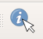
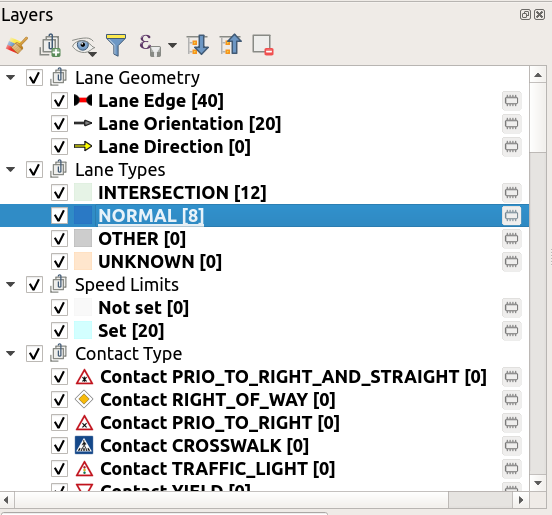

# QGis 3.1x

## Table of contents
1. [Introduction](#introduction)
2. [CARLA ad_map_access toolbar](#toolbar)
3. [How to use the tool](#howtouse)
4. [Layer view ](#Layerview)

### Introduction <a name="introduction"></a>
Visualization of the map data is crucial to be able to inspect the data and work with it.
Therefore a plugin for the *free QGIS tool (currently Version 3.1x)* is available providing insight into the inner data model of the map.

The following map data is e.g. visualized there:

- road layout with individual lane segments
- the supporting points of the borders (red)
- the nominal driving direction within the lane (yellow arrows inside)
- the type of lane: normal (light blue), intersection (light green)
- lane contact relations like left/right neighbor, successor/predecessor lane
- right-of-way regulation, speed limits and other landmarks

Also basic tools to test the map matching and routing functionality, prediction test(with runtime selection of route creation mode, prediction duration and length) are also provided.

### Download and Install (without building)
You can download the latest version of the plugin from the [Release](https://github.com/carla-simulator/map/releases/latest) artifacts as *zip* file.

  1. Install ad-map-access python via pip
  ```bash
   $> pip install --user ad-map-access
  ```

  2. Then you run qgis and install the plugin from the plugins menu (`Plugins > Manage and Install Plugins > Install from ZIP`),
  choose the zip file that was previously downloaded.

  

  3. Change to `Installed` tab and make sure `CARLA ad_map_access` is enabled.

  4. Enjoy!

### After building
If you are building the tool from sources
(see also [Build instructions](https://ad-map-access.readthedocs.io/en/latest/BUILDING/index.html))
you have to set the PYTHONPATH, LD_LIBRARY_PATH and QGIS_PLUGINPATH before starting:
```bash
 map$> echo "Setting PYTHONPATH and LD_LIBRARY_PATH:"
 map$> source install/setup.bash
 map$> echo "QGIS plugin built! Let's test it out:"
 map$> export QGIS_PLUGINPATH=<path/to/>map/install/ad_map_access_qgis/share/qgis/python/plugins
 map$> qgis
```

### CARLA ad_map_access toolbar <a name="toolbar"></a>
The CARLA ad_map_access toolbar looks like this when the plugin is loaded:

|  |
| -- |
| *Screenshot of the QGIS toolbar when the plugin is loaded into the tool* |

The different features provided by the plugin are:
#### Load New Map
  : Selecting this icon will open a File Dialog Box which allows the user to select and load a map for visialization in QGis 3.1x. Post the selection of the map, it is loaded and visible in qgis.
#### Unload currently loaded Map
  : Selecting this icon will unload the currently loaded map.
#### Set Snap Altitude
  : By using this tool, user can hover anywhere over the map and click to set the default altitude for calculations during Snapping Test, Routing Test and Prediction Test.
#### Snapping Test
  : User can select this icon to activate the snapping test. Also ENU co-ordinates of the map-snapped listed points is also visible.
#### Routing Test
  : Selecting this icon, will provide the options to the user to select a mode for route creation. After selecting the appropriate route creation mode, the start point and the end point of the route is selected on the map, which then generates the route.
#### Routing Restart
  : User can select this icon to restart the routing test.
#### Prediction Test
  : Provides the Prediction test on the loaded map. On selecting this icon, user will get options to select the route creation mode, length and duration of the prediction test. Post selection of the test specific features, the lane for prediction can be selected on the map.
#### Enable all lane IDs
  : Generally it is required to select each layer(INTERSECTION, NORMAL, OTHER or UNKNOWN) under Lane Types, and then activate the lane id attribute to visualize the lane ids on the map. Enabling this button helps the user to bypass those steps, and directly visualize the lane ids on the map. Also, disabling the button removes the lane IDs from the map.

### How to use the tool <a name="howtouse"></a>
- Once the plugin is loaded, the CARLA ad_map_access toolbar is now available for use.
- The map is loaded using the load map icon on the CARLA ad_map_access toolbar.
  Currently, it is possible to directly load a txt configuration file and xodr files from ad_map_access.
  In addition it is possible to use the txt configuration file to specify some configuration values.
  Linking an example [file](https://github.com/carla-simulator/map/blob/master/ad_map_access/impl/tests/test_files/Town01.txt).
  Also please refer to the [configuration structure](https://ad-map-access.readthedocs.io/en/latest/ad_map_access/apidoc/html/        classad_1_1map_1_1config_1_1MapConfigFileHandler.html).
 
      *Select the map from the file system*

- The map after successful loading shows all the layers with the Lane Geometry, Lane types, Lane Contact Types, Landmark, Topology and speed limits.
 
      *One of the loaded maps view in Qgis 3.1x*

- To set the snap altitude the icon is selected from the toolbar and the default altitude is set by selecting the point on the map.
 
      *The Qgs logger shows the snapped altitude after it is set*

- In order to start the routing test, the routing test is activated, the option for the route creation mode is selected. Next, the start point and the destination point of the route is snapped on the map which generates the route, highlighted on the map in green.
  
      *Select the route creation mode and the generated route is highlighted*

- In order to view the lane ids of all layers at once, select the option from the toolbar and the lane ids are visible on the map.
 
      *With the button enabled we can see all lane IDs of loaded layers.*

- To conduct a Prediction Test, the route creation mode, length and duration of the test is selected on enabling the prediction test button from the CARLA ad_map_access toolbar.
  

      *The Prediction test with all the selected options during run time*

- Different features of the loaded map can also be visualized using the feature identification tool  in the attributes toolbar.
After selecting the layer to be visualized, the feature identification tool on a layer shows the feature of the layers in a separate panel for better visualization of map data.
 
     *The Normal Layer under Lane Types is selected and the features are displayed*

- The in-built python console in Qgis 3.1x  can also be used to verify different functionalities of Qgis while reading and understanding any plugin code. All the qgis core modules and gui modules are already a part of the environment which makes debugging for the user easier.

- In order to manually enable any attributes of a particular layer, the *Layer Properties* of the layer is accessed any attribute is enabled to be visible.
  

### Layer view <a name="Layerview"></a>
When a map is loaded in QGis, all the layers of the map are visible in the Layers Panel on the QGis main window as below:


Each of the layer group can then be expanded to see the layer contents and further access the attributes of each layer.


To make any one group visible, the other groups can be unchecked in the box right next to it. This removes the specific layer group from the map.
